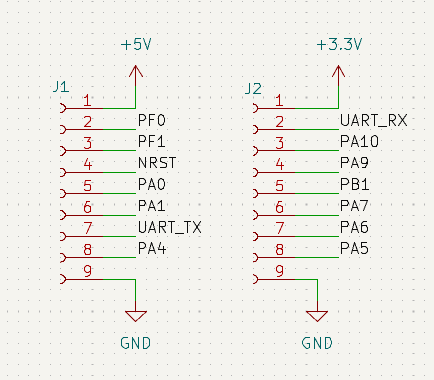
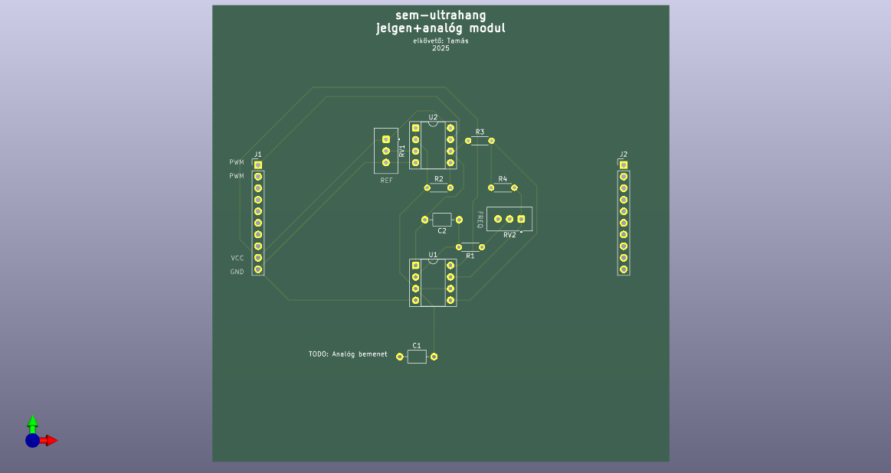

# Szendvicspanel

## Megtervezendő:
 - [ ] board mérete
 - [ ] lábak száma, lábkiosztás az összes modult figyelembe véve (ld: [rendszerterv](../rendszerterv.txt))
 - [ ] legyenek-e átkonfigurálhatók a lábak (pl. jumperekkel)
 - [ ] analóg modul a jelgenerátorra
   - [ ] schematic
   - [ ] PCB
 - [ ] BOOST-konverteres tápegység
   - [ ] schematic
   - [ ] PCB
 - [ ] jelgenerátor PCB
 - [ ] H-híd + driver PCB
 - [ ] mikrokontroller PCB

## Mikrokontroller pinout

 - **a kép vízszintesen tükrözve van**
 - socketek kellenek neki
 - lehet-e neki tápot adni?

## WIP:
jelgenerátor modul PCB (ld: `jelgen.kicad_pro`)
 - opamp a REF feszültségen
 - PWM generátor
 - az analóg input jelenleg hanging:(
 - 10x10 cm, pazarló a hellyel
 - 2x10 pin, csak 4-et használ
 - egyoldalú, THT
 - teszt pontok még kellenek rá
 - még van mit pofozni rajta

H-híd + driver PCB (ld: `hbridge.kicad_pro`)
 - P-csatornás FET-ek a híd felére, vezérlőjelek átkötve
 - PCB még nincs